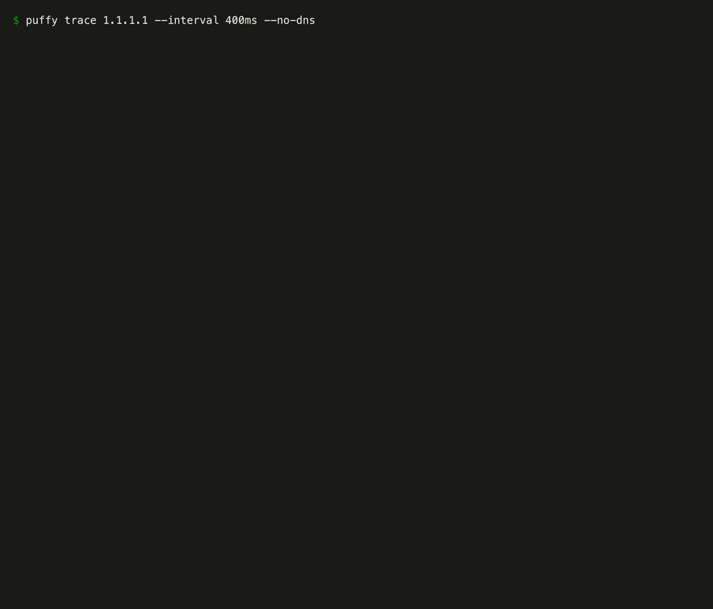

# puffy

ping and traceroute, drawn as **time series**.

`ping` and `traceroute` each answer half a question. `ping` tells you the path is
bad but not where; `traceroute` tells you what the path looked like once. Neither
shows you *when*. puffy keeps every probe as a point in time and draws the
result, so the two questions an operator actually has — **where is the loss, and
when did it happen** — are answered by looking at the picture.



```
$ puffy trace 1.1.1.1 --no-dns

puffy trace 1.1.1.1  round 20 · 7s · every 350ms · timeout 2s

                        session 7s ────────────────────────────
ttl host                   loss    last     avg    best   worst  rtt over time →
  1 192.168.40.1          40.0%     2.7     3.1     2.0     8.5  ▁▁▁▁▁▁▁▁×▁××▁××▁××▁×
  2 42.148.76.1           40.0%    16.1    17.6    12.1    29.1  ▃▃▂▂▃▂▂▂×▃××▂××▃××▃×
  3 10.202.98.36           0.0%    25.8    33.0    16.8   127.8  █▃▃▃▅▅▃▃▃▃▃▅▃▃▅▃▇▃▃▃
  4 10.1.8.117             0.0%    20.4    17.1    11.3    25.9  ▃▃▃▂▃▃▂▂▃▃▃▂▂▃▂▃▃▂▂▃
  5 175.129.17.101         0.0%    44.0    45.6    38.4    55.9  ▆▇▆▆▆▆▆▆▆▆▆▇▆▇▇▇▇▆▆▆
  6 220.152.46.114         0.0%    41.4    39.6    34.4    50.8  ▆▆▇▆▆▆▆▆▆▇▆▆▆▆▆▆▆▆▆▆
  7 210.173.176.127       65.0%    46.8    51.1    41.7    66.7  ××▆▆××▆××××▇×××▇█×▆×
  8 103.22.201.29          0.0%    38.4    40.4    27.4    59.2  ▄▅▇▅▅▅▅▅▅▄▅▅▅▅▅▇▅▅▅▅
  9 ● 1.1.1.1              0.0%    38.8    40.0    34.6    56.2  ▆▆▆▆▆▇▆▆▆▆▆▆▆▆▆▆▆▆▆▆

  packet loss — where it lands, and when   0% ·░▒▓█ 100%
  1 192.168.40.1        ········█·██·██·██·█
  2 42.148.76.1         ········█·██·██·██·█
  7 210.173.176.127     ██··██·████·███··█·█

  latency stalls — rtt above each hop's own baseline   1.25× ·░▒▓█ 4×+
  1 192.168.40.1        █······░·░·····░····
  2 42.148.76.1         ▒▓··░····▒·····▒····
  3 10.202.98.36        █··░▒▓░····▒·░▓░▓··░
  4 10.1.8.117          ░░▒·▒·····░··░·▒░··░
  5 175.129.17.101      ·············░·░····
  6 220.152.46.114      ··░······░··········
  7 210.173.176.127     ················░···
  8 103.22.201.29       ··▒·········░··░░···
  9 1.1.1.1             ·····░···░··········

  7s of history, 1 round per column

  what the graph shows
  ◆ ttl 1 +2.8s to +3.0s: 33.3% of probes lost across the path (session average 16.1%), worst at ttl
    1
  ◆ ttl 1 +3.5s to +3.7s: 33.3% of probes lost across the path (session average 16.1%), worst at ttl
    1
  ◆ ttl 1 +4.6s to +5.1s: 33.3% of probes lost across the path (session average 16.1%), worst at ttl
    1
  ℹ ttl 1 192.168.40.1 40.0% loss here but 0.0% at the cleanest hop downstream - this hop
    rate-limits its own ICMP replies, it is not dropping traffic
  ℹ ttl 2 42.148.76.1 40.0% loss here but 0.0% at the cleanest hop downstream - this hop rate-limits
    its own ICMP replies, it is not dropping traffic
  ℹ ttl 7 210.173.176.127 65.0% loss here but 0.0% at the cleanest hop downstream - this hop
    rate-limits its own ICMP replies, it is not dropping traffic
```

Not one of those findings is a fault. Three routers answer about themselves only
when they feel like it — the local gateway, the ISP edge, and an exchange router
seven hops out — and puffy says so, because every probe still reached `1.1.1.1`
and the destination lost nothing. Telling that apart from a real fault is the
difference between a red herring and an incident.

## Install

```sh
go install github.com/oppai/puffy@latest
```

Or from a checkout:

```sh
go build -o puffy .
```

Requires Go 1.22 or newer. There are no runtime dependencies: the HTML report
embeds everything it needs and loads nothing from the network.

### Permissions

puffy uses **unprivileged ICMP datagram sockets**, so it normally needs no root
— including for `trace`, because those sockets can both set an outgoing TTL and
receive the `TimeExceeded` replies that traceroute is built on.

| Platform | What you need |
|---|---|
| macOS | nothing |
| Linux | `sudo sysctl -w net.ipv4.ping_group_range="0 2147483647"`, or `sudo setcap cap_net_raw+ep $(which puffy)` |

If the socket cannot be opened, puffy prints the specific fix rather than a bare
"operation not permitted". `--privileged` switches to a raw socket for the cases
where that is what you have.

## Usage

```
puffy ping   [flags] <host>     round-trip time and loss over time
puffy trace  [flags] <host>     per-hop round-trip time and loss over time
puffy render [flags] <file>     turn a saved session into an HTML report
```

```sh
puffy ping 8.8.8.8                                    # live, until Ctrl-C
puffy trace github.com --interval 500ms
puffy trace 1.1.1.1 --count 300 --json run.json --html run.html
puffy ping example.com --json - | jq '.hops[0].stats'
puffy render run.json -o report.html
```

Common flags (`puffy ping --help` for the rest):

| Flag | Meaning |
|---|---|
| `-i, --interval` | time between rounds (default `1s`) |
| `-W, --timeout` | how long before a probe counts as lost (default `2s`) |
| `-c, --count` | stop after N rounds; `0` runs until interrupted |
| `-m, --max-ttl` | highest TTL to probe (`trace`, default 30) |
| `--ttl` | TTL for the probes (`ping`, default 64) |
| `--window` | rounds of history to graph; `0` scrolls one column per round |
| `--history` | rounds of raw samples to keep (default `50000`, `0` keeps every round) |
| `--json PATH` | write the session document (`-` for stdout) |
| `--html PATH` | write the HTML report (`-` for stdout) |
| `--theme` | `auto`, `dark` or `light` |
| `--plain` | one line per probe instead of the live graph |
| `--no-color`, `--color` | force colour off or on |

When `--json -` or `--html -` is used, the graphs and summary move to stderr so
stdout stays a clean document you can pipe.

## Reading the graphs

**Two clocks, never mixed.** A live frame answers two different questions, and
one set of numbers cannot answer both: *is this path bad right now*, and *has it
been bad*. So the live hop table carries two groups of columns under labelled
rules — `window`, the stretch of time the graph beside them draws, and
`session`, every probe since the run started:

```
                     window 1m ─────────────────────  session 6h12m ─────────────────
ttl host                loss    last     avg   worst     loss     avg     p95   worst  rtt over time →
  3 10.202.98.36        0.0%    25.7    24.5    25.9     4.1%    39.8   120.0   412.0  ▅▅▄▄▅▄▅▄▅▅▄▅▄▅▄▅▄▅▄▅▅▄▅▄▅▄▄▅▄▅
```

That hop is fine at the moment and has not been all evening — which is the
finding, and it is invisible in either group alone.

The **graph always scrolls**. By default every round gets a column of its own,
so the row shifts left one place each time a probe lands and the window is as
much history as the width can hold at that resolution; only an interval faster
than a quarter-second folds rounds together, and then just enough of them to
keep a column under a quarter-second of time. Nothing here is allowed to grow
with the run.

That last part is the whole point. Sizing the window in *time* — a fixed minute,
say — sounds equivalent and is not: at a 250ms interval a minute is ten rounds
to a column, so the picture shifts once every two and a half seconds, and since
a column shows the worst of its rounds the glyph usually does not change even
then. The graph redraws eight times a second and looks frozen. `--window` sets
the window in rounds when you want a longer span folded in and can live with
that.

The **session** figures come from statistics folded as each probe arrives, so
they cover the whole run exactly, however long it is and whatever the raw
history was capped at. The summary printed after the run — and after Ctrl-C — is
session-scoped throughout, so its table has one group of columns rather than two.

**The hop table.** One row per TTL, one column per slice of time. Block height
is round-trip time on a scale shared by every row, so rows are comparable at a
glance. That scale is the largest value on screen that is *not* an
outlier — Tukey's fence, more than one and a half interquartile ranges above
the upper quartile of the columns drawn — rather than simply the largest.
Scaled to the worst value, a single two-second stall puts every ordinary column
on the floor block and holds it there for as long as it is in view, which on a
path that spikes every few seconds is most of the time; scaled to a fixed
percentile instead, a path whose hops all sit near the top of the range
saturates every row. So a full block means "at or above the top of the scale",
and how far above is in the `worst` column and the stall panel. Colour is *state* against that hop's
own baseline — normal, elevated, stalling — so a hop that is queueing relative
to itself still stands out on a path where some other hop is slower in absolute
terms. The two channels answer different questions and neither restates the
other.

- `×` — every probe in that column was lost
- a coloured block — some probes were lost, and the height still shows how slow
- a blank — no probe landed in that column

**The loss panel** is the *where and when*: rows are hops, columns are time, and
the shade is the share of probes lost in that slice. A vertical band means every
hop lost at the same moment; a horizontal band means one hop is losing all along.
Like the graph above it, the panel describes the window, and only hops with
something to show in that window get a row — the `session` loss column is what
tells you a quiet hop was losing an hour ago.

**The stall panel** measures each hop against its own uncongested baseline (its
20th percentile *over the session*, not over the window — a baseline recomputed
from the visible minute would drift up while the hop was stalling and colour the
stall normal a minute after it started). Cells within 1.25× of baseline are left
blank as ordinary jitter, so what is left is real queueing.

Both panels carry the magnitude in the glyph (`·░▒▓█`) as well as in the colour,
so they still read with `--no-color`, in a greyscale screenshot, or with any form
of colour vision.

**Loss at a hop is usually not a fault.** Most routers deprioritise generating
ICMP replies about themselves while forwarding traffic perfectly. puffy tells the
two apart by looking downstream: if any later hop answers cleanly, packets are
getting through, and the loss was only in the replies. That is the difference
between the `loss origin` and `icmp limited` findings in *what the graph shows* —
and it is why puffy compares against the *cleanest* hop downstream rather than
the worst, so two consecutive rate-limiting routers cannot cover for each other.

## JSON and HTML

`--json` writes the measurement: every probe it still holds, with its round, its
offset from the start of the run, its round-trip time (`null` when lost) and
which address answered, plus the per-hop statistics for the whole run.

A session that runs for hours keeps a **rolling raw history** — `--history`
rounds, 50000 by default — so an unattended run has a bounded footprint instead
of growing until the machine complains. `samples_from_round` says where the kept
samples begin; `stats` still covers every probe ever sent, because those figures
are folded as the probes arrive rather than derived from the samples that remain.
`--history 0` keeps every round.

```jsonc
{
  "tool": "puffy", "schema": 1, "mode": "trace",
  "target": "1.1.1.1", "target_ip": "1.1.1.1",
  "started_at": "...", "ended_at": "...",
  "interval_ms": 400, "timeout_ms": 2000, "rounds": 90,
  "samples_from_round": 0,
  "hops": [
    {
      "ttl": 1,
      "addrs": ["192.168.40.1"],
      "final": false,
      "samples": [
        { "r": 0, "t": 0,   "rtt": 2.61, "ip": "192.168.40.1" },
        { "r": 1, "t": 400, "rtt": null }
      ],
      "stats": { "sent": 90, "recv": 41, "lost": 49, "loss_pct": 54.4,
                 "p20_ms": 2.4, "p50_ms": 2.9, "p95_ms": 8.1, "...": "" }
    }
  ],
  "insights": [ { "kind": "icmp_limited", "ttl": 1, "detail": "..." } ]
}
```

`--html`, or `puffy render` on a saved session, produces a single self-contained
file: the destination's latency over time with a crosshair tooltip, both hop ×
time heatmaps, small multiples per hop, and the hop table as the plain-text twin
of every chart. It has a light and a dark theme, a time-range filter, and a
`Patterns` toggle that swaps the heatmap colour for an ordered diagonal texture
for print, forced-colours and colour-vision needs.

Because the JSON holds the raw samples, `render` is a pure function of the file —
re-run it any time, and the findings are recomputed rather than trusted. Where a
long run trimmed its oldest samples, the stored statistics stand rather than
being narrowed to what is left, so the report cannot disagree with the run that
produced it about what was measured.

## How it works

A ping is a traceroute with one fixed TTL, so both modes are the same engine: one
ICMP socket, one matching table, one timeout path.

Probes are identified by their **ICMP sequence number**, never by the payload. A
router answering a `TimeExceeded` is only obliged to quote the offending IP
header plus eight bytes — the bare ICMP header — and real routers do exactly
that, so any scheme that needs the payload echoed back silently loses hops. The
sequence number survives that truncation; the echo ID does not, because Linux
ping sockets rewrite it, which is why the ID is only checked on raw sockets.

Each round sends one probe per TTL, staggered across the front of the interval.
Firing thirty packets at once is the quickest way to trip a router's ICMP rate
limiter and then measure loss that puffy itself caused.

A redraw only ever costs the window it draws. The collector keeps each hop's
probes as a flat, pointer-free rolling buffer plus an accumulator that has
already folded every probe taken, so a frame reads a screenful of samples rather
than the whole run, and the run's own statistics never have to be recomputed
from a million values four times a second. That is what keeps an hours-long
session drawing — and interrupting — as promptly as a fresh one.

Ctrl-C means two things. The first one ends the run: probes already on the wire
are given a moment to land, the alternate screen is handed back at once, and the
session is summarised and written out. A second one leaves immediately, with the
terminal restored and exit status 130 — because installing a signal handler
switches off Go's own "die on SIGINT", and a tool that swallows the second Ctrl-C
is a tool you cannot get out of.

## Development

`make` with no arguments lists every target.

```sh
make build          # ./puffy, version-stamped from git describe when tagged
make check          # gofmt check, vet, tests, tests under -race
make eyeball        # print the rendered terminal frames for visual inspection
make demo           # trace and open the HTML report (TARGET=host to change it)
make dist           # cross-compile into out/
make cover-html     # coverage report
```

`make demo TARGET=github.com COUNT=200 INTERVAL=250ms` is the quickest way to see
all four views against a real path.

`make gif` re-records `docs/demo.gif` from a live run. It drives puffy under a
real pty, so the frames in the animation are the ones the tool actually paints;
it needs Chrome and ImageMagick, which nothing else in the project does.

It passes `--no-dns`, which keeps ISP hostnames out of the frame — but be clear
about what that does not do. The addresses stay in the picture and anyone can
reverse them back to the same names, so a recording still says which ISP it was
made on. If that matters for your demo, trace a target whose path you do not
mind publishing, or raise `--first-ttl` past your own access segment.

On Linux, `make setcap` grants the built binary `CAP_NET_RAW` so it can probe
without root; on macOS the same target tells you nothing is needed.

The terminal and HTML palettes are not chosen by eye. Both use a documented
sequential ramp per magnitude scale, validated for hue consistency, monotone
lightness, step separation and contrast against the surface each one renders on.
Do not hand-edit a ramp step without re-running that check — the pale end against
a light surface is what breaks first, and on a dark surface the ramps run in the
opposite direction so that "near zero" still recedes.

```
internal/model    measurement schema, statistics, time bucketing, path analysis
internal/probe    ICMP engine (send, match, time out) and the session collector
internal/tui      braille line chart, sparklines, heatmaps, live layout
internal/report    JSON reader/writer and the embedded HTML report
```
